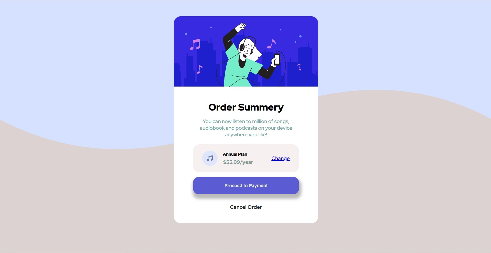

# Frontend Mentor - Order summary card solution 

This is my solution to the [Order summary card challenge on Frontend Mentor] (link)
This frontend chllanges help me to improve my coding skills bt building realistic projects.

## Table of content

- [Overview](#overview)
  - [The challenge](#the-challenge)
  - [Screenshot](#screenshot)
  - [Links](#links)
- [My process](#my-process)
  - [Built with](#built-with)
  - [What I learned](#what-i-learned)
  - [Continued development](#continued-development)
  - [Useful resources](#useful-resources)
- [Author](#author)

## Overview

The project is based on music subscription card. the This project contain illustrations and different icon. It also contain links and buttons. All of the element has to be in structured manner to enhance the user experience.

### The challenge

1. The major Challange that, i faced is to keep everything in structure. things get pretty easy if u put your element in proper container.

2. the second issue i faced is to aline the elements which is esay to understand and readable.

### Screenshot



### Link

- Solution URL: [ My Project ]( http://127.0.0.1:5500/Music-template/Index.html )

## My Process

### Build With


 - Semantic HTML5 markup
 - CSS custom properties
 - Flex Box


### What I learned

i learn about different type of tags and how to set margin padding. i have learned about how to use selactor, how they behave if we use it. how multiple tag response when they are use togather 

learn some new css fuctionalnalities like :

```css
display: flex;
```
In combination with 'float' and 'position', determines the type of box or boxes that are generated for an element.

```css
justify-content: space-around;
```
Aligns flex items along the cross axis of the current line of the flex container.

### Continued development

 Really looking forword to build more projects like this, With new challanges and tackle those challanges with optimize solutions

### Useful resources
- [FreeCodeCamp](https://www.freecodecamp.org/news/media-query-css-example-max-and-min-screen-width-for-mobile-responsive-design/)
- [MDN CSS](https://developer.mozilla.org/en-US/docs/Web/CSS)


## Author
- Website - [Gourav Rattan](https://www.google.co.in)
-  Mentor - [Google](https://www.google.co.in) , [FeeCodeCamp](https://www.freecodecamp.org/)